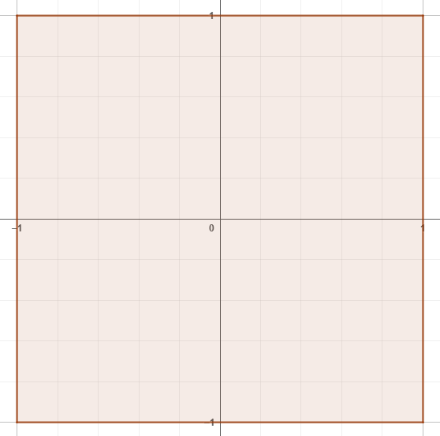
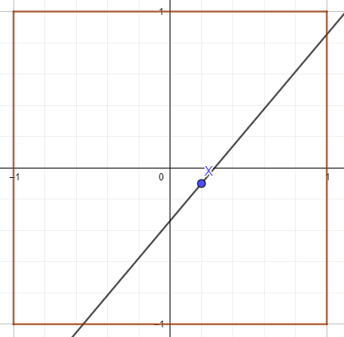

# 基本概念

## 时间单位

### 延迟值（Offset）

### 节拍（Beat）

**节拍** 是（几乎？）所有音乐共同具有的概念。量化每分钟的节拍数的数值被称作 BPM (Beat Per Minute)。

PhiFormat 设计上支持多 BPM 的音乐。

### Tick：PhiFormat 基本时间单位

**Tick** 是 PhiFormat 中基本的时间单位。

在 PhiFormat 中，Tick 为整数值，从 0 开始计算。0 tick 被视为曲目的起始（0 second）。每一拍被划分为 24 个 Tick。例如， tick 24 意味第 2 拍的开始。

!!! note "为什么每一拍被划分为 24 个 tick？"
    很简单：`8*3=24`。

    将一个拍数以 3 和 4 的倍数进行划分，将会带给谱面创作者极大的便利。为了满足可能的需求，我们将它划分为 8 和 3 的倍数。这应该能满足绝大多数的谱面创作者的需求。

    我们 **强烈不推荐** 将音符放置在比 1/24 更为细致的位置：这样做只会为玩家带来糟糕的体验。如果确实有需要，请考虑对 BPM 进行倍数操作。

## 坐标系统和判定线

!!! warning
    当我们讨论这一章节的时候，我们假定你有至少高中一年级的数学知识。

### 基准坐标系和单位长度

**基准坐标系** 是用于定位判定线控制点的坐标系。

假设有一个 1:1 大小的平面，以该平面的正中心作为原点，向水平和竖直方向各引一条坐标轴作为 x, y 轴，定义单位长度为半个平面长度。这就是基准坐标系。

将这个平面 **沿 y 轴方向** 伸缩，即可伸缩至 4:3 或者 16:9 的屏幕大小。

    
    

### 判定线与控制点

在一个坐标系上过一点画直线需要什么？这一点的坐标和斜率。同样的道理，在 PhiFormat 中，定义一个判定线的方法是在基准坐标系中选取一个 **控制点**，然后用这一点的坐标和旋转角来确定这条判定线。

我们规定：旋转角 0° 的判定线水平放置，此时朝上的面为这条判定线的“上面”，朝下的面为这条判定线的“下面”。

!!! note "为什么不用斜率？"
    竖直直线的斜率不存在。

下面是一条控制点在 (0.2,-0.1)，旋转角为 50° 的判定线在三种缩放下的基准坐标系的展现：

    
    

### 相对坐标系

## 音符

## 判定线事件

### 构建判定线（Construct）

### 移动（Move）

### 旋转（Rotate）

### 判定线可见性（LineVis）

### 音符可见性（NoteVis）

### 速度（Speed）

### 结束判定线（Destruct）

## 缓冲（Easing）
